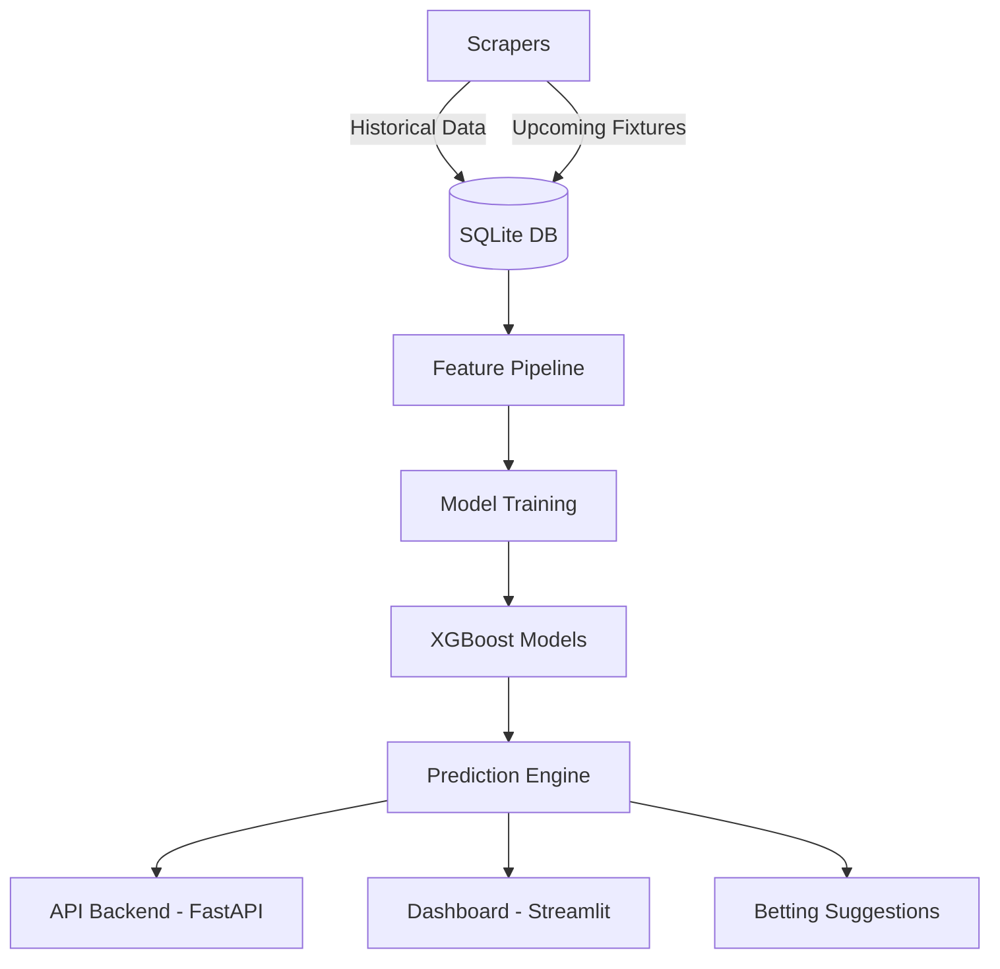

# ⚽ Advanced AI Football Predictor

[](https://opensource.org/licenses/MIT)
[](https://www.python.org/downloads/)
[](https://github.com/astral-sh/ruff)
[](http://mypy-lang.org/)

An end-to-end Machine Learning pipeline that predicts football match outcomes, expected goals, and highlights value bets using XGBoost.

This project encompasses data scraping, feature engineering, model training, an API backend (FastAPI), and an interactive frontend dashboard (Streamlit) to present high-confidence match predictions and betting suggestions.

---

## 📐 Architecture



## 🌟 Features

- **Automated Data Pipeline:** Fetches upcoming fixtures and historical match data from multiple sources.
- **Machine Learning Models:** 
  - **Outcome Classifier:** XGBoost multiclass classifier predicts Home Win, Draw, or Away Win probabilities.
  - **Goals Regressors:** XGBoost regressors with Poisson objectives estimate expected goals for both teams.
- **Betting Engine (`suggest_bets.py`):** Automatically identifies and suggests the best value bets based on calculated model confidence and projected goal totals.
- **RESTful API (`FastAPI`):** Programmatic access to the predictions, enabling easy integration with other tools or bots.
- **Interactive Dashboard (`Streamlit`):** A clean, user-friendly UI to view upcoming fixture predictions, model accuracy metrics, and expected probabilities.
- **Job Scheduler:** Automated daily updates for fetching fixtures and updating predictions.

## 🛠️ Tech Stack

- **Python 3.9+**
- **Machine Learning:** `xgboost`, `scikit-learn`, `pandas`, `numpy`
- **Backend/API:** `FastAPI`, `uvicorn`, `SQLAlchemy`, `SQLite`
- **Frontend/Dashboard:** `Streamlit`
- **Web Scraping:** `BeautifulSoup`, `requests`

## 🚀 Installation & Setup

1. **Clone the repository:**
   ```bash
   git clone https://github.com/yourusername/football_predictor.git
   cd football_predictor
   ```

2. **Set up environment:**
   Using the provided `Makefile`:
   ```bash
   make install
   ```
   Or manually:
   ```bash
   python3 -m venv venv
   source venv/bin/activate
   pip install -e .
   ```

3. **Configure Environment Variables:**
   ```bash
   cp .env.example .env
   # Edit .env and add your FOOTBALL_DATA_API_KEY
   ```

## 🏃‍♂️ Usage

### 🛠️ Development Tasks
The project includes a `Makefile` for common tasks:
- `make lint`: Run code quality checks.
- `make test`: Run the test suite.
- `make format`: Automatically format the code.

### 📈 Training the Models
Before generating predictions, you need to train the machine learning models:
```bash
python -m models.train
```

### 🌐 Running the API Server
To start the FastAPI backend:
```bash
make run-api
```
The API will be available at `http://127.0.0.1:8000`. Explore the interactive docs at `/docs`.

### 📊 Running the Streamlit Dashboard
To launch the interactive dashboard:
```bash
make run-dashboard
```

### 💰 Getting Betting Suggestions
To get a quick terminal output of the top recommended bets for today:
```bash
python suggest_bets.py
```

## 📂 Project Structure

```text
football_predictor/
│
├── api/                   # FastAPI backend implementation
├── config/                # Configuration settings & environment variables
├── dashboard/             # Streamlit dashboard UI
├── db/                    # Database models and SQLite setup
├── features/              # Feature engineering pipeline scripts
├── models/                # ML model definition and training scripts
├── scrapers/              # Scripts to fetch football fixture and result data
├── tests/                 # Unit testing suite
│
├── Makefile               # Task runner for development
├── pyproject.toml         # Project configuration and dependencies
├── backfill.py            # Historical data backfilling utility
├── predict_advanced.py    # Advanced prediction logic
├── suggest_bets.py        # Analyzes predictions to output recommended bets
└── README.md              # Project documentation
```

## 🤝 Contributing
Contributions are welcome! Please see [CONTRIBUTING.md](CONTRIBUTING.md) for guidelines.

## 📄 License
This project is open-source and available under the [MIT License](LICENSE).
